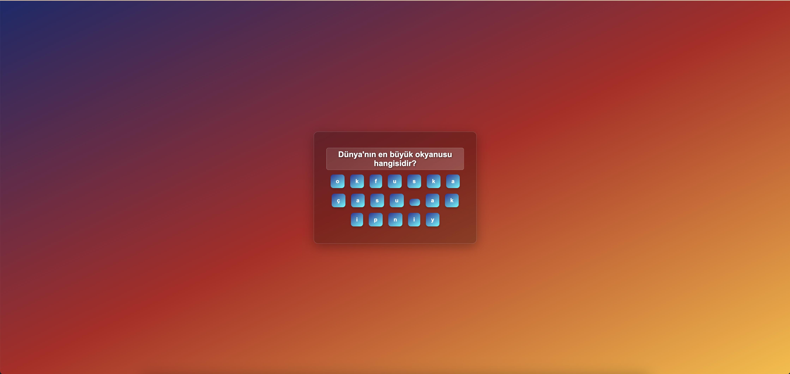
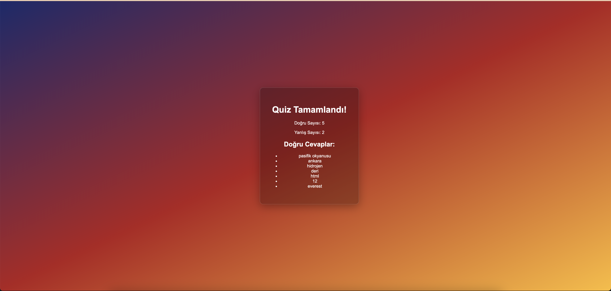

# Letter Quiz Application

A React-based interactive quiz application where users guess answers by selecting letters to form words.



## Demo

Check out the live demo of the application [here](https://fluffy-mandazi-ae8717.netlify.app).

## Features

- **Interactive Letter Selection**: Users select letters to form answers to quiz questions
- **Real-time Feedback**: Users can see their progress and remove selected letters if needed
- **Random Letter Generation**: Additional random letters are added to increase challenge
- **Quiz Completion Summary**: Displays correct and wrong answer counts after quiz completion
- **Answer Review**: Lists all correct answers at the end of the quiz

## How It Works

1. The app presents questions one at a time from a data file
2. Each answer is split into individual letters and mixed with random letters
3. Users click on letters to form their answer
4. Users can remove letters by clicking on them in the answer area
5. The app automatically checks the answer when all letter slots are filled
6. When all questions are answered, a summary and list of correct answers are displayed

## Technical Implementation

- **React Hooks**: Uses `useState` and `useEffect` for state management
- **Dynamic Rendering**: UI updates based on quiz progress and user interactions
- **Array Manipulation**: Shuffling algorithm for randomizing letter order
- **Conditional Rendering**: Different views for active quiz vs. completion summary

## Project Structure

- `App.js`: Main component containing quiz logic and UI
- `data.js`: Contains questions and answers in an exportable array
- `App.css`: Styling for the application components

## Getting Started

1. Clone the repository
2. Install dependencies with `npm install`
3. Run the development server with `npm start`
4. Create your own questions by updating the `DATA` array in `data.js`

## Customization

The quiz can be easily customized by modifying the `DATA` array in `data.js`. Each quiz item should follow this format:

```javascript
{
  question: "Your question here",
  answer: "Answer"
}
```

## Future Enhancements

- Timer functionality
- Difficulty levels
- Score tracking
- Animation effects
- Category-based quizzes

## Screenshots

### Quiz Interface


### Quiz Results


---
For any inquiries or issues, please feel free to contact [Muhammed Talha Ergüney](mailto:talhaergy@gmail.com).